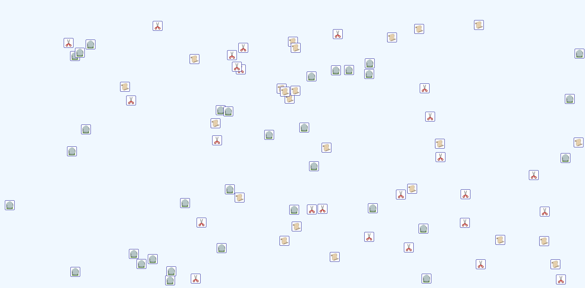
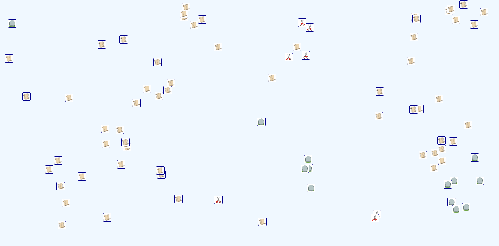
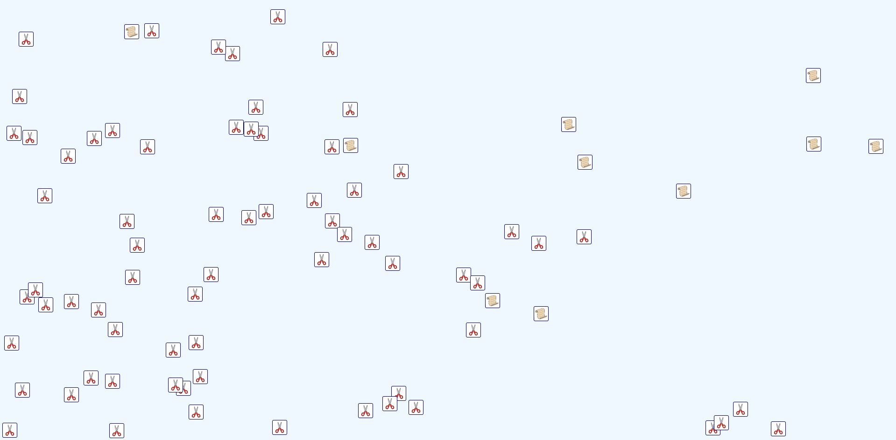
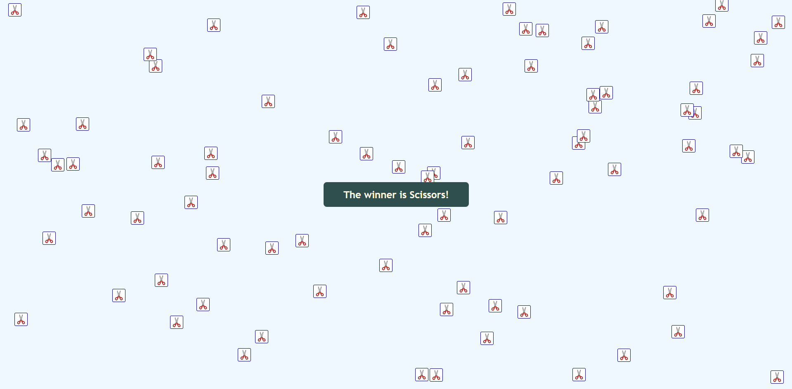

# Rock Paper Scissors
In this version of rock-paper-scissors, 80 players are spawned in a virtual world and given a random direction and velocity. When two players collide, they engage in a game of rock-paper-scissors to determine the winner. The loser is captured and transformed into the winner. They then continue side by side on their journey to take over the entire board.

This simulation was based on some tweet I saw passing by. If someone can refer me to the initial author I am happy to give them credit for the fun idea 😀

## Some screenshots of the course of the game
### 🚀 Start of the game

### 📰 Paper is ahead

### 💪 Scissors taking control

### 🏆 Game over

